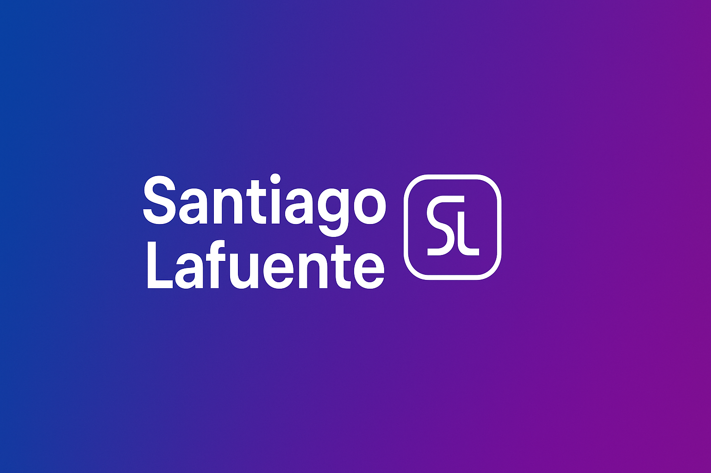

  

<h1 align="center">👋 ¡Hola! Soy Santi</h1>

  💻 <strong>Desarrollador en formación | Estudiante de G.S DAM</strong> 
  🔧 Mécanico industrial reconvertido al mundo del software 
  🌍 Desde Valencia, España

---

### 🚀 Sobre mí

Soy una persona práctica y curiosa. Después de años en el entorno industrial, decidí cambiar de sector y dedicarme al desarrollo de software.  
Actualmente estudio **Desarrollo de Aplicaciones Multiplataforma (DAM)** y estoy centrado en aprender **Java, bases de datos, HTML, CSS y frameworks modernos**.  
Mi objetivo es crear proyectos bien estructurados, con código limpio y funcional, que no solo sirvan para aprobar, sino para aprender de verdad.

---

### 🧠 En lo que estoy trabajando

- 🪶 Proyecto **App-MoodTrack** – registro de estados de ánimo con Spring Boot  
- 💼 Aplicación de gestión de citas RRHH con **Java + MySQL**  
- 🧮 Pequeños proyectos de consola (juegos, conversores, ejercicios de DAM)

---

### 🧰 Tecnologías que manejo

  

---

### 📈 GitHub Stats

  
  

---

### 🌱 Objetivos

- Mejorar mi dominio de **Java** , **Phyton** y **bases de datos**
- Crear un portafolio sólido con proyectos reales  
- Aprender desarrollo móvil con **Kotlin** y **Android Studio**  
- Contribuir a proyectos open source cuando tenga más nivel

---

### 📫 Cómo contactar

📧 **santilafuente.dev@gmail.com**  
💼 [LinkedIn](https://www.linkedin.com) *www.linkedin.com/in/santiago-lafuente-hernández-796783226*  
🐙 [GitHub](https://github.com/santilafu)

---

  <em>“El mejor código es el que se entiende al leerlo.”</em>

<!--
**santilafu/santilafu** is a ✨ _special_ ✨ repository because its `README.md` (this file) appears on your GitHub profile.

Here are some ideas to get you started:

- 🔭 I’m currently working on ...
- 🌱 I’m currently learning ...
- 👯 I’m looking to collaborate on ...
- 🤔 I’m looking for help with ...
- 💬 Ask me about ...
- 📫 How to reach me: ...
- 😄 Pronouns: ...
- ⚡ Fun fact: ...
-->
